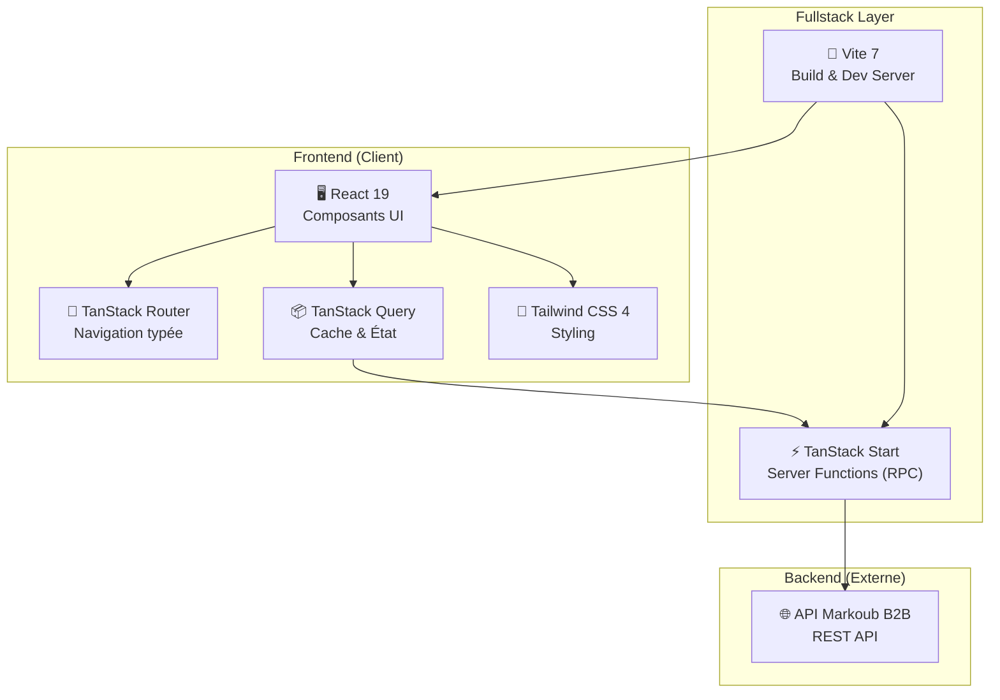
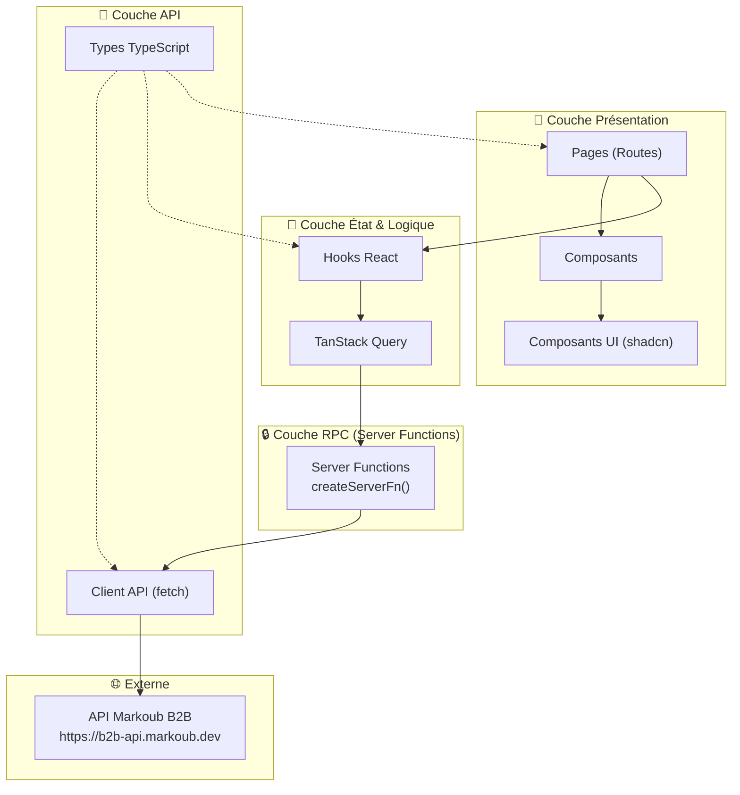
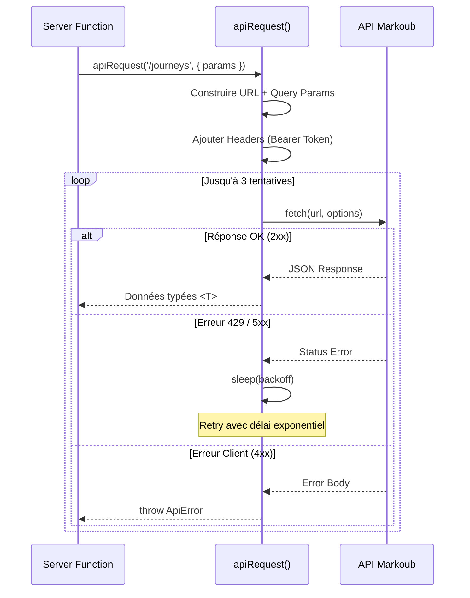
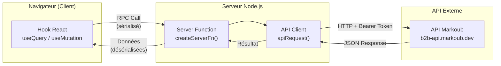
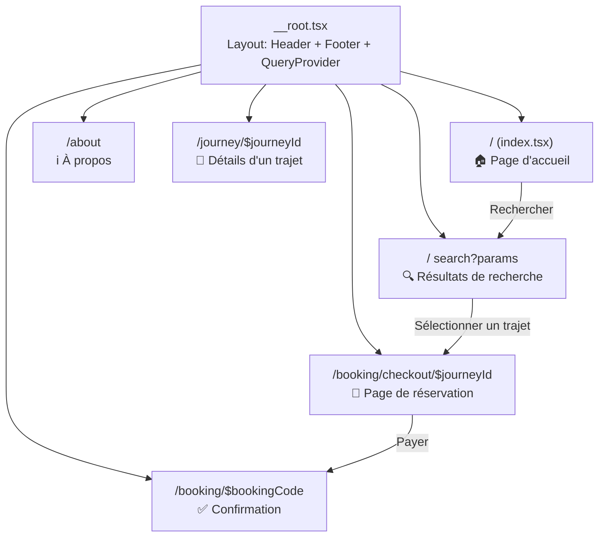
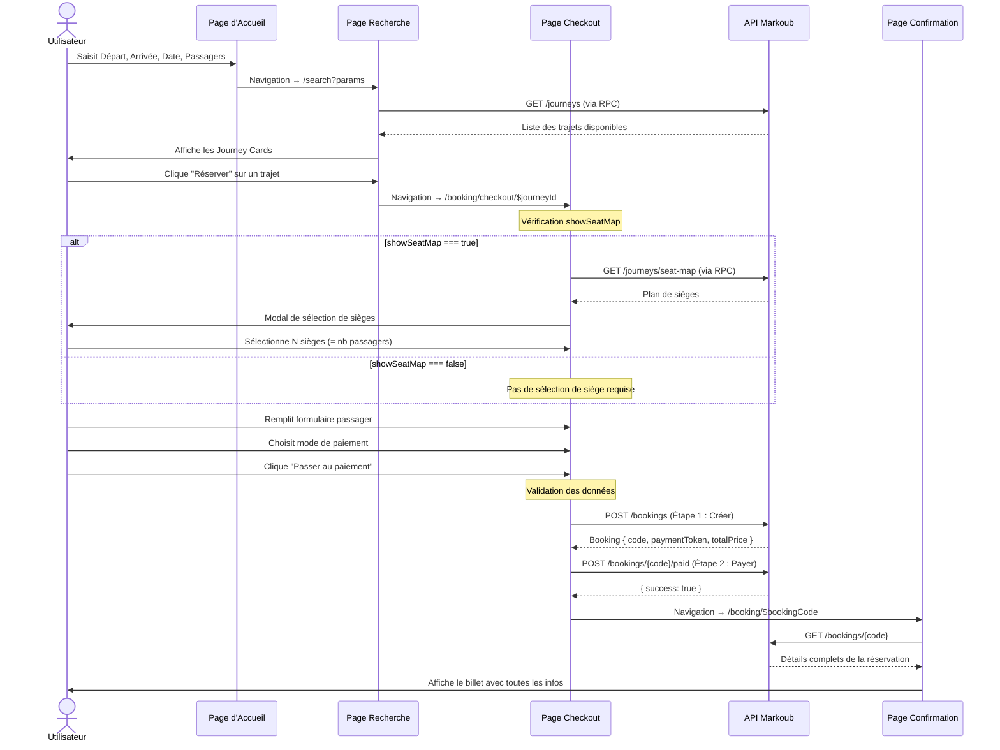
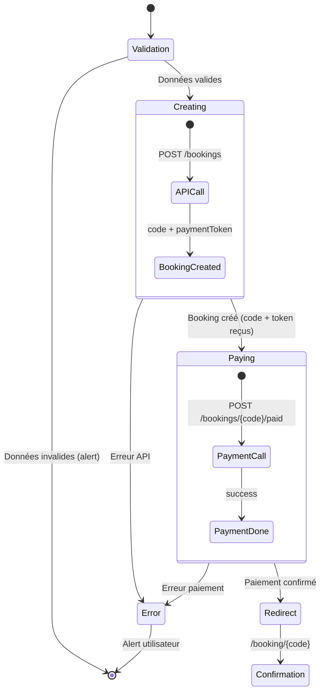
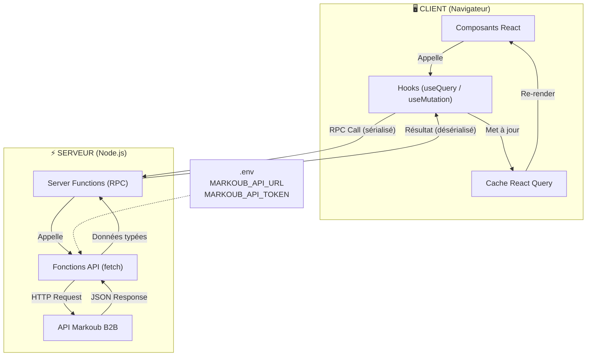
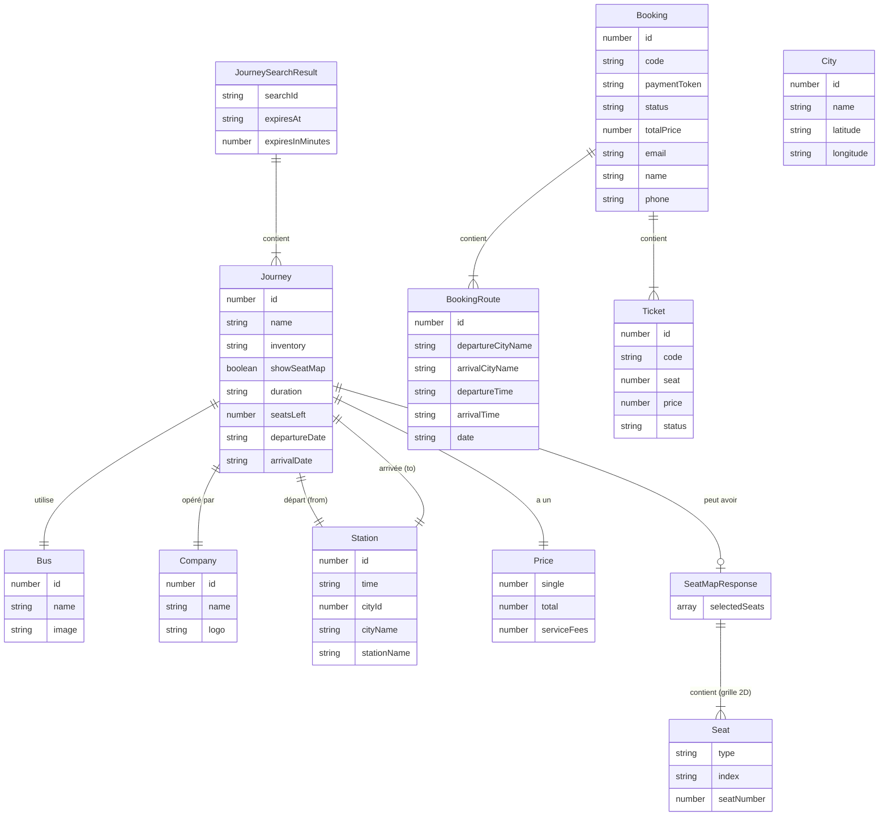

# Rapport Technique — Plateforme de Réservation de Bus "Trans GHAZALA"

## Table des Matières

1. [Vue d'Ensemble du Projet](#1-vue-densemble-du-projet)
2. [Stack Technique](#2-stack-technique)
3. [Architecture Globale](#3-architecture-globale)
4. [Structure du Projet](#4-structure-du-projet)
5. [Couche API (Backend)](#5-couche-api-backend)
6. [Couche RPC (Server Functions)](#6-couche-rpc-server-functions)
7. [Couche Hooks (État & Données)](#7-couche-hooks-état--données)
8. [Couche UI (Pages & Composants)](#8-couche-ui-pages--composants)
9. [Logique Métier (Business Logic)](#9-logique-métier-business-logic)
10. [Documentation API Markoub](#10-documentation-api-markoub)
11. [Flux de Données](#11-flux-de-données)
12. [Modèles de Données (TypeScript)](#12-modèles-de-données-typescript)

---

## 1. Vue d'Ensemble du Projet

Cette application est une **plateforme de réservation de billets de bus interurbains** pour le groupement **Trans GHAZALA / PULLMAN DU SUD**, un acteur majeur du transport au Maroc. Elle permet aux utilisateurs de :

- Rechercher des trajets entre villes marocaines
- Consulter les horaires, prix et disponibilités
- Sélectionner des sièges sur un plan de bus interactif
- Réserver et payer un billet en ligne
- Consulter, télécharger ou annuler une réservation existante

L'application s'appuie sur l'**API B2B Markoub** (`b2b-api.markoub.dev`) comme backend de données pour l'ensemble des opérations.

---

## 2. Stack Technique

| Couche | Technologie | Version | Rôle |
|---|---|---|---|
| **Runtime** | Node.js | — | Environnement d'exécution JavaScript |
| **Framework** | TanStack Start (React) | latest | Framework fullstack SSR/SSG avec server functions |
| **UI Library** | React | 19.2 | Bibliothèque de composants d'interface |
| **Routeur** | TanStack Router | latest | Routage typé avec file-based routing |
| **État serveur** | TanStack React Query | 5.95 | Cache, fetching et synchronisation de données |
| **Bundler** | Vite | 7.3 | Build tool ultra-rapide avec HMR |
| **CSS** | Tailwind CSS | 4.1 | Framework CSS utility-first |
| **Composants UI** | shadcn/ui + Radix UI | — | Composants accessibles et personnalisables |
| **Icônes** | Lucide React | 0.545 | Bibliothèque d'icônes SVG |
| **Validation** | Zod | 4.3 | Schémas de validation TypeScript |
| **Dates** | date-fns | 4.1 | Utilitaires de manipulation de dates |
| **Langage** | TypeScript | 5.7 | Typage statique |
| **Package Manager** | pnpm | — | Gestionnaire de paquets performant |
| **Tests** | Vitest + Testing Library | — | Tests unitaires et d'intégration |

### Diagramme du Stack



---

## 3. Architecture Globale

L'application suit une architecture **en couches** (layered architecture) avec une séparation stricte des responsabilités. Le pattern utilisé est souvent appelé **"Clean Frontend Architecture"**.



### Principes d'Architecture

1. **Séparation Client/Serveur** : Les appels API sont effectués côté serveur via les Server Functions de TanStack Start. Le token API n'est **jamais exposé au client**.
2. **File-Based Routing** : Les routes sont générées automatiquement à partir de la structure des fichiers dans `src/routes/`.
3. **Type Safety** : Toutes les couches partagent les mêmes types TypeScript définis dans `src/api/types.ts`.
4. **Server-Side Rendering (SSR)** : TanStack Start permet le rendu côté serveur pour optimiser le SEO et les performances initiales.

---

## 4. Structure du Projet

```
PFE_Project/
├── .env                          # Variables d'environnement (API URL, Token)
├── package.json                  # Dépendances et scripts
├── vite.config.ts                # Configuration Vite + plugins
├── tsconfig.json                 # Configuration TypeScript
│
├── public/                       # Fichiers statiques
├── Docs/                         # Documentation
│
└── src/
    ├── router.tsx                # Configuration du routeur TanStack
    ├── routeTree.gen.ts          # Arbre de routes auto-généré
    ├── styles.css                # Feuilles de style globales (Tailwind)
    │
    ├── api/                      # 📡 Couche API (serveur uniquement)
    │   ├── client.ts             # Client HTTP générique avec retry
    │   ├── types.ts              # Interfaces et types TypeScript
    │   ├── cities.api.ts         # Endpoints des villes
    │   ├── journeys.api.ts       # Endpoints des trajets
    │   ├── seat-map.api.ts       # Endpoint plan de sièges
    │   └── bookings.api.ts       # Endpoints des réservations
    │
    ├── rpc/                      # 🔒 Couche RPC (Server Functions)
    │   ├── cities.ts             # getCities
    │   ├── journeys-search.ts    # searchJourneys
    │   ├── journeys-stops.ts     # getJourneyStops
    │   ├── seat-map.ts           # getSeatMap
    │   ├── bookings-create.ts    # createBooking
    │   ├── bookings-pay.ts       # markBookingPaid
    │   ├── bookings-get.ts       # getBooking
    │   └── bookings-cancel.ts    # cancelBooking
    │
    ├── hooks/                    # 🔄 Hooks React (React Query wrappers)
    │   ├── use-cities.ts         # useCities()
    │   ├── use-journeys.ts       # useJourneySearch(), useSeatMap()
    │   ├── use-seat-map.ts       # useSeatMap() (alternative)
    │   └── use-booking.ts        # useCreateBooking(), useBooking(), etc.
    │
    ├── lib/                      # 🛠️ Utilitaires
    │   ├── utils.ts              # Fonction cn() (clsx + tailwind-merge)
    │   └── constants.ts          # Constantes (routes, villes, infos)
    │
    ├── routes/                   # 🧭 Pages (File-Based Routing)
    │   ├── __root.tsx            # Layout racine (Header/Footer/QueryProvider)
    │   ├── index.tsx             # Page d'accueil
    │   ├── about.tsx             # Page À propos
    │   ├── search.tsx            # Page de résultats de recherche
    │   ├── journey/
    │   │   └── $journeyId.tsx    # Détails d'un trajet
    │   └── booking/
    │       ├── checkout.$journeyId.tsx  # Page de réservation (checkout)
    │       └── $bookingCode.tsx         # Page de confirmation
    │
    └── components/               # 🎨 Composants React
        ├── Header.tsx            # En-tête du site
        ├── Footer.tsx            # Pied de page
        ├── ThemeToggle.tsx       # Bouton thème clair/sombre
        ├── home/                 # Composants page d'accueil
        │   ├── hero-section.tsx
        │   ├── stats-section.tsx
        │   ├── services-section.tsx
        │   └── popular-routes.tsx
        ├── search/               # Composants recherche
        │   └── search-form.tsx
        ├── journey/              # Composants trajets
        │   └── journey-card.tsx
        ├── booking/              # Composants réservation
        │   ├── seat-selection-card.tsx
        │   ├── seat-map-modal.tsx
        │   ├── passenger-form-section.tsx
        │   ├── passenger-form.tsx
        │   ├── payment-section.tsx
        │   └── booking-sidebar.tsx
        └── ui/                   # Composants UI réutilisables (shadcn)
            ├── button.tsx
            ├── calendar.tsx
            ├── input.tsx
            ├── label.tsx
            └── skeleton.tsx
```

---

## 5. Couche API (Backend)

### 5.1 Client HTTP (`api/client.ts`)

Le client API est un wrapper autour de `fetch()` qui s'exécute **exclusivement côté serveur**. Il fournit :

- **Authentification** : Token Bearer via env `MARKOUB_API_TOKEN`
- **Retry automatique** : 3 tentatives avec backoff exponentiel pour les erreurs 429 et 5xx
- **Gestion d'erreurs** : Classe `ApiError` personnalisée avec `statusCode` et `code`
- **Logging** : Chaque requête est loguée dans la console serveur



### 5.2 Fichiers API

| Fichier | Fonctions | Endpoint API |
|---|---|---|
| `cities.api.ts` | `fetchCities(lang)` | `GET /cities` |
| `journeys.api.ts` | `fetchJourneys(params)` | `GET /journeys` |
| `journeys.api.ts` | `fetchJourneyStops(params)` | `GET /journeys/stops` |
| `seat-map.api.ts` | `fetchSeatMap(params)` | `GET /journeys/seat-map` |
| `bookings.api.ts` | `createBooking(data)` | `POST /bookings` |
| `bookings.api.ts` | `markBookingPaid(code, data)` | `POST /bookings/{code}/paid` |
| `bookings.api.ts` | `fetchBooking(code)` | `GET /bookings/{code}` |
| `bookings.api.ts` | `cancelBooking(code)` | `DELETE /bookings/{code}` |
| `bookings.api.ts` | `fetchBookingPdf(code)` | `GET /bookings/{code}/pdf` |

---

## 6. Couche RPC (Server Functions)

La couche RPC utilise les **Server Functions** de TanStack Start (`createServerFn()`). Ces fonctions s'exécutent côté serveur mais sont appelées depuis le client comme des fonctions normales. Cela garantit que :

- Le **token API** n'est jamais exposé au navigateur
- Les appels réseau vers l'API Markoub sont faits depuis le serveur Node.js
- Le client communique uniquement avec son propre serveur



### Liste des Server Functions

| Fichier RPC | Fonction exportée | Méthode | Appelle |
|---|---|---|---|
| `cities.ts` | `getCities` | GET | `fetchCities()` |
| `journeys-search.ts` | `searchJourneys` | GET | `fetchJourneys()` |
| `journeys-stops.ts` | `getJourneyStops` | GET | `fetchJourneyStops()` |
| `seat-map.ts` | `getSeatMap` | GET | `fetchSeatMap()` |
| `bookings-create.ts` | `createBooking` | POST | `apiCreateBooking()` |
| `bookings-pay.ts` | `markBookingPaid` | POST | `apiMarkBookingPaid()` |
| `bookings-get.ts` | `getBooking` | GET | `fetchBooking()` |
| `bookings-cancel.ts` | `cancelBooking` | POST | `apiCancelBooking()` |

---

## 7. Couche Hooks (État & Données)

Les hooks React encapsulent la logique de fetching avec **TanStack React Query**. Ils fournissent :
- **Caching automatique** avec `staleTime` configuré
- **Refetch conditionnel** via le paramètre `enabled`
- **Mutations** avec gestion d'état (loading, error, success)

### Hooks de Lecture (useQuery)

| Hook | Fichier | Query Key | Données retournées |
|---|---|---|---|
| `useCities(lang)` | `use-cities.ts` | `['cities', lang]` | `City[]` |
| `useJourneySearch(params)` | `use-journeys.ts` | `['journeys', params]` | `JourneySearchResult` |
| `useJourneyStops(id, searchId)` | `use-journeys.ts` | `['journey-stops', id, searchId]` | `JourneyStop[]` |
| `useSeatMap(id, searchId)` | `use-journeys.ts` | `['seat-map', id, searchId]` | `SeatMapResponse[]` |
| `useBooking(code)` | `use-booking.ts` | `['booking', code]` | `Booking` |

### Hooks de Mutation (useMutation)

| Hook | Fichier | Action |
|---|---|---|
| `useCreateBooking()` | `use-booking.ts` | Crée une nouvelle réservation |
| `useMarkBookingPaid()` | `use-booking.ts` | Marque une réservation comme payée |
| `useCancelBooking()` | `use-booking.ts` | Annule une réservation |

---

## 8. Couche UI (Pages & Composants)

### 8.1 Carte de Navigation (Sitemap)



### 8.2 Pages

| Route | Fichier | Description |
|---|---|---|
| `/` | `index.tsx` | Page d'accueil avec Hero, Stats, Services, Routes populaires |
| `/search` | `search.tsx` | Résultats de recherche avec filtres et liste de journey cards |
| `/about` | `about.tsx` | Page de présentation de l'entreprise |
| `/journey/$journeyId` | `journey/$journeyId.tsx` | Détails détaillés d'un trajet spécifique |
| `/booking/checkout/$journeyId` | `booking/checkout.$journeyId.tsx` | Page checkout : sièges + formulaire passager + paiement |
| `/booking/$bookingCode` | `booking/$bookingCode.tsx` | Confirmation de réservation avec billet |

### 8.3 Composants

#### Composants Globaux
- `Header.tsx` — Barre de navigation principale
- `Footer.tsx` — Pied de page avec informations de l'entreprise
- `ThemeToggle.tsx` — Basculement thème clair/sombre

#### Composants Page d'Accueil (`home/`)
- `hero-section.tsx` — Bannière principale avec formulaire de recherche
- `stats-section.tsx` — Statistiques clés (+15K tickets/jour, +80 destinations)
- `services-section.tsx` — Présentation des services (Parc, Réseau, Tourisme, Messagerie)
- `popular-routes.tsx` — Grille des itinéraires populaires

#### Composants Recherche (`search/`)
- `search-form.tsx` — Formulaire complet : ville départ, ville arrivée, date, nombre de passagers

#### Composants Trajet (`journey/`)
- `journey-card.tsx` — Carte de résultat avec prix, horaires et bouton de réservation

#### Composants Réservation (`booking/`)
- `seat-selection-card.tsx` — Carte résumant les sièges sélectionnés
- `seat-map-modal.tsx` — Modal plein écran avec plan interactif du bus
- `passenger-form-section.tsx` — Formulaire des informations passager (nom, email, téléphone)
- `payment-section.tsx` — Sélection du mode de paiement (carte ou espèces)
- `booking-sidebar.tsx` — Résumé du trajet et prix avec bouton "Passer au paiement"

#### Composants UI (`ui/`) — shadcn/ui
- `button.tsx`, `calendar.tsx`, `input.tsx`, `label.tsx`, `skeleton.tsx`

---

## 9. Logique Métier (Business Logic)

### 9.1 Flux de Réservation Complet



### 9.2 Règles de Validation

#### Validation des Sièges (Conditionnelle)

```
SI journey.showSeatMap === true ALORS
  ├── Le passager DOIT sélectionner des sièges
  ├── Le nombre de sièges sélectionnés DOIT = nbrOfPassengers
  └── Blocage de la réservation si non respecté

SINON (showSeatMap === false / null / undefined)
  ├── Pas de sélection de siège requise
  ├── La section "Sélection de siège" affiche un message informatif
  └── Le processus de paiement est directement accessible
```

#### Validation du Formulaire Passager

```
REQUIS :
  ├── name   → Ne doit pas être vide
  ├── email  → Ne doit pas être vide
  └── phone  → Ne doit pas être vide
```

### 9.3 Processus de Paiement Séquentiel

Le paiement se fait en **2 étapes distinctes** gérées séquentiellement dans `handleProcessBooking()` :



### 9.4 Gestion du Thème (Clair/Sombre)

Le thème est géré via un script d'initialisation injecté dans le `<head>` pour éviter le flash de thème (FOUC). Il prend en charge 3 modes : `light`, `dark`, et `auto` (suit les préférences système).

---

## 10. Documentation API Markoub

### Base URL
```
https://b2b-api.markoub.dev
```

### Authentification
```
Authorization: Bearer {MARKOUB_API_TOKEN}
Content-Type: application/json
```

### Endpoints

#### 🏙️ Villes

| Méthode | Endpoint | Description |
|---|---|---|
| `GET` | `/cities?lang={fr}` | Liste de toutes les villes desservies |

**Réponse** : `City[]`
```typescript
{ id: number, name: string, latitude: string, longitude: string }
```

---

#### 🚌 Trajets

| Méthode | Endpoint | Description |
|---|---|---|
| `GET` | `/journeys` | Rechercher des trajets disponibles |
| `GET` | `/journeys/stops` | Obtenir les arrêts intermédiaires |
| `GET` | `/journeys/seat-map` | Obtenir le plan de sièges |

**GET /journeys — Paramètres :**

| Paramètre | Type | Requis | Description |
|---|---|---|---|
| `departureCityId` | number | ✅ | ID de la ville de départ |
| `arrivalCityId` | number | ✅ | ID de la ville d'arrivée |
| `date` | string | ✅ | Date au format `YYYY-MM-DD` |
| `nbrOfPassengers` | number | ✅ | Nombre de passagers |
| `searchId` | string | ❌ | ID de recherche pour réutilisation |

**Réponse** : `JourneySearchResult`
```typescript
{
  searchId: string,          // Identifiant unique de cette session de recherche
  expiresAt: string,         // Date d'expiration de la session
  expiresInMinutes: number,  // Minutes avant expiration
  journeys: Journey[]        // Liste des trajets disponibles
}
```

**GET /journeys/stops — Paramètres :**

| Paramètre | Type | Requis |
|---|---|---|
| `journeyId` | number | ✅ |
| `searchId` | string | ✅ |

**GET /journeys/seat-map — Paramètres :**

| Paramètre | Type | Requis |
|---|---|---|
| `journeyId` | number | ✅ |
| `searchId` | string | ✅ |

**Réponse** : `SeatMapResponse[]`
```typescript
{
  selectedSeats: { seatNumber: number, index: string }[],
  seatMap: Seat[][]  // Grille 2D du bus
}
// Chaque Seat :
{ type: 'available' | 'reserved' | 'empty' | 'closed', index: string, seatNumber: number }
```

---

#### 🎫 Réservations

| Méthode | Endpoint | Description |
|---|---|---|
| `POST` | `/bookings` | Créer une nouvelle réservation |
| `POST` | `/bookings/{code}/paid` | Marquer comme payée |
| `GET` | `/bookings/{code}` | Obtenir les détails d'une réservation |
| `DELETE` | `/bookings/{code}` | Annuler une réservation |
| `GET` | `/bookings/{code}/pdf` | Télécharger le billet PDF |

**POST /bookings — Body :**
```typescript
{
  journeyId: string,
  searchId: string,
  name: string,
  phone: string,
  email: string,
  seats: number[]    // [] si showSeatMap est false
}
```

**Réponse** : `Booking`
```typescript
{
  id: number,
  code: string,              // Code unique de réservation
  paymentToken: string,      // Token pour le processus de paiement
  totalPrice: number,
  status: string,            // 'pending' | 'paid' | 'confirmed' | 'cancelled'
  routes: BookingRoute[],
  tickets: Ticket[],
  // ... autres champs
}
```

**POST /bookings/{code}/paid — Body :**
```typescript
{
  paidPrice: string,
  referenceNumber: string,
  additionalInfo?: string
}
```

---

## 11. Flux de Données

### Vue d'ensemble du flux de données dans l'application



### Cycle de vie d'une requête

1. **Composant** → Le composant React appelle un hook (ex: `useJourneySearch()`)
2. **Hook** → Le hook utilise `useQuery()` avec une `queryFn` qui appelle une Server Function
3. **Server Function** → La server function s'exécute côté serveur, extrait les paramètres, et appelle la fonction API
4. **API Client** → `apiRequest()` construit la requête HTTP avec le token d'authentification
5. **API Externe** → La requête est envoyée à `b2b-api.markoub.dev`
6. **Retour** → La réponse remonte à travers toutes les couches jusqu'au composant
7. **Cache** → React Query met en cache le résultat et gère le rafraîchissement

---

## 12. Modèles de Données (TypeScript)

### Diagramme des Relations entre Types



---

> **Note** : Ce rapport reflète l'état actuel de l'application. L'architecture est conçue pour être maintenable et extensible, avec une séparation claire entre les couches de présentation, logique métier, et accès aux données.
