# Rapport de PFE — Plateforme de Réservation de Bus "Pullman du Sud"

## REMERCIEMENTS
*(Rédigez vos remerciements ici à l'attention de vos encadrants et du jury)*

---

## RÉSUMÉ ET ABSTRACT

### Résumé
*(Votre résumé de projet en français)*

### Abstract
*(Your project abstract in English)*

### ملخص
*(ملخص مشروعك بالعربية)*

---

## Tables des Matières :

1. [REMERCIEMENTS](#remerciements)
2. [RÉSUMÉ ET ABSTRACT](#résumé-et-abstract)
3. [LISTE DES FIGURES ET TABLEAUX](#liste-des-figures-et-tableaux)
4. [LISTE DES ABRÉVIATIONS](#liste-des-abréviations)
5. [INTRODUCTION GÉNÉRALE](#introduction-générale)
6. [CHAPITRE 1 : CONTEXTE GÉNÉRAL DU PROJET](#chapitre-1--contexte-général-du-projet)
7. [CHAPITRE 2 : ANALYSE ET CONCEPTION](#chapitre-2--analyse-et-conception)
8. [CHAPITRE 3 : RÉALISATION ET IMPLÉMENTATION](#chapitre-3--réalisation-et-implémentation)
9. [CONCLUSION GÉNÉRALE](#conclusion-générale)
10. [BIBLIOGRAPHIE](#bibliographie)
11. [WEBOGRAPHIE](#webographie)
12. [ANNEXES](#annexes)

---

## LISTE DES FIGURES ET TABLEAUX
*(Liste à générer selon vos diagrammes et tableaux)*

---

## LISTE DES ABRÉVIATIONS
- **API** : Application Programming Interface
- **RPC** : Remote Procedure Call
- **SSR** : Server-Side Rendering
- *(Ajoutez vos autres abréviations)*

---

## INTRODUCTION GÉNÉRALE
*(Contexte général, problématique, et annonce du plan)*

---

## CHAPITRE 1 : CONTEXTE GÉNÉRAL DU PROJET

### 1.1 Vue d'Ensemble du Projet

Cette application est une **plateforme de réservation de billets de bus interurbains** pour la compagnie **Pullman du Sud**, un acteur majeur du transport au Maroc. Elle permet aux utilisateurs de :

- Rechercher des trajets entre villes marocaines
- Consulter les horaires, prix et disponibilités
- Sélectionner des sièges sur un plan de bus interactif
- Réserver et payer un billet en ligne
- Consulter, télécharger ou annuler une réservation existante

L'application s'appuie sur l'**API B2B Markoub** (`b2b-api.markoub.dev`) comme backend de données pour l'ensemble des opérations.

---

## CHAPITRE 2 : ANALYSE ET CONCEPTION

### 2.1 Stack Technique

| Couche                    | Technologie              | Version | Rôle                                             |
| ------------------------- | ------------------------ | ------- | ------------------------------------------------- |
| **Runtime**         | Node.js                  | —      | Environnement d'exécution JavaScript             |
| **Framework**       | TanStack Start (React)   | latest  | Framework fullstack SSR/SSG avec server functions |
| **UI Library**      | React                    | 19.2    | Bibliothèque de composants d'interface           |
| **Routeur**         | TanStack Router          | latest  | Routage typé avec file-based routing             |
| **État serveur**   | TanStack React Query     | 5.95    | Cache, fetching et synchronisation de données    |
| **Bundler**         | Vite                     | 7.3     | Build tool ultra-rapide avec HMR                  |
| **CSS**             | Tailwind CSS             | 4.1     | Framework CSS utility-first                       |
| **Composants UI**   | shadcn/ui + Radix UI     | —      | Composants accessibles et personnalisables        |
| **Icônes**         | Lucide React             | 0.545   | Bibliothèque d'icônes SVG                       |
| **Validation**      | Zod                      | 4.3     | Schémas de validation TypeScript                 |
| **Dates**           | date-fns                 | 4.1     | Utilitaires de manipulation de dates              |
| **Langage**         | TypeScript               | 5.7     | Typage statique                                   |
| **Package Manager** | pnpm                     | —      | Gestionnaire de paquets performant                |
| **Tests**           | Vitest + Testing Library | —      | Tests unitaires et d'intégration                 |

### Diagramme du Stack

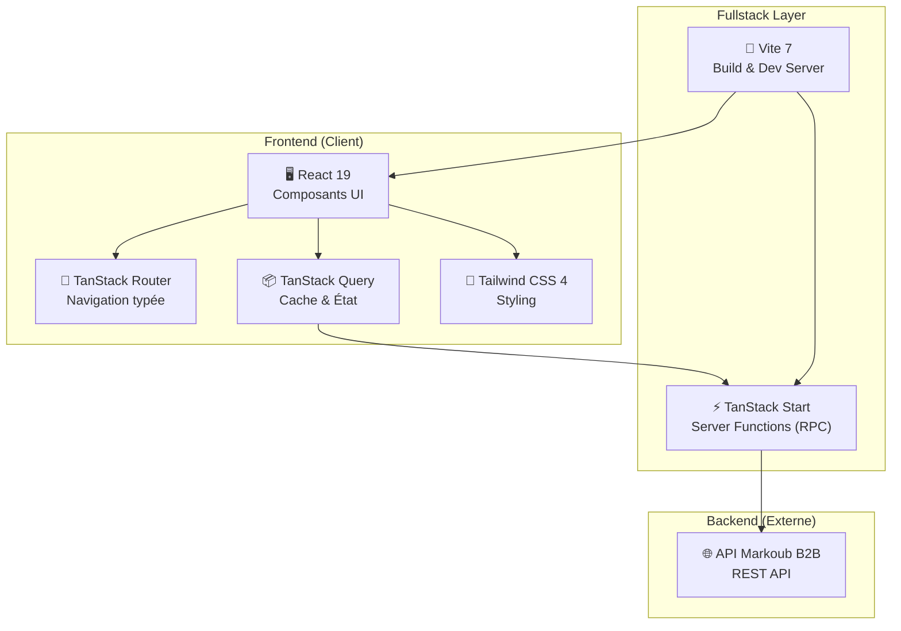

---

## 3. Architecture Globale

L'application suit une architecture **en couches** (layered architecture) avec une séparation stricte des responsabilités. Le pattern utilisé est souvent appelé **"Clean Frontend Architecture"**.

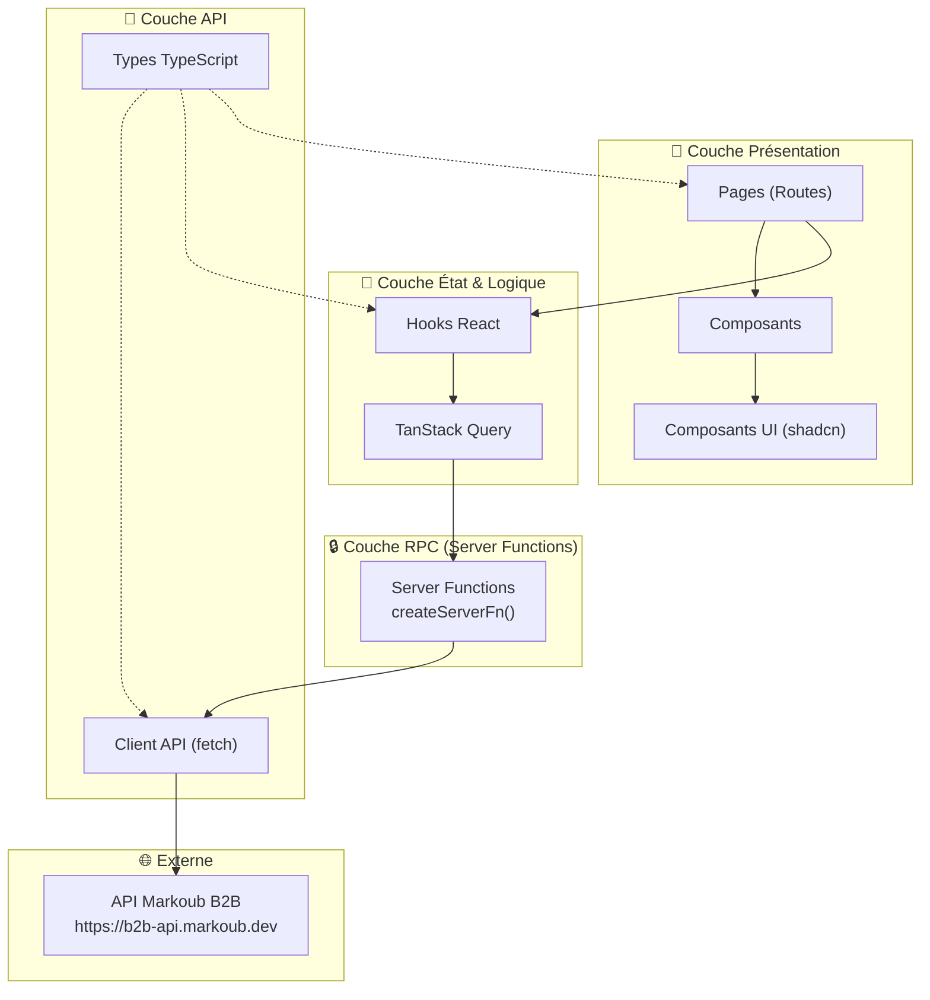

### Principes d'Architecture

1. **Séparation Client/Serveur** : Les appels API sont effectués côté serveur via les Server Functions de TanStack Start. Le token API n'est **jamais exposé au client**.
2. **File-Based Routing** : Les routes sont générées automatiquement à partir de la structure des fichiers dans `src/routes/`.
3. **Type Safety** : Toutes les couches partagent les mêmes types TypeScript définis dans `src/api/types.ts`.
4. **Server-Side Rendering (SSR)** : TanStack Start permet le rendu côté serveur pour optimiser le SEO et les performances initiales.

---

## CHAPITRE 3 : RÉALISATION ET IMPLÉMENTATION

### 3.1 Structure du Projet

```
PFE_Project/
├── .env                          # Variables d'environnement (API URL, Token)
├── package.json                  # Dépendances et scripts
├── vite.config.ts                # Configuration Vite + plugins
├── tsconfig.json                 # Configuration TypeScript
│
├── public/                       # Fichiers statiques
├── Docs/                         # Documentation
│
└── src/
    ├── router.tsx                # Configuration du routeur TanStack
    ├── routeTree.gen.ts          # Arbre de routes auto-généré
    ├── styles.css                # Feuilles de style globales (Tailwind)
    │
    ├── api/                      # 📡 COUCHE API (Communiquant avec Markoub)
    │   ├── client.ts             # Cœur des requêtes HTTP. Gère l'ajout du token, les retours d'erreurs (ApiError) et les tentatives automatiques (retry) si le serveur Markoub échoue.
    │   ├── types.ts              # Contient toutes les interfaces TypeScript (Journey, Seat, Booking...) pour assurer que l'application ne manipule pas de données inattendues.
    │   └── *.api.ts              # Fichiers séparés par domaine (cities, journeys, bookings) qui définissent les URLs exactes appelées.
    │
    ├── rpc/                      # 🔒 COUCHE RPC (Remote Procedure Call - Sécurité)
    │   # Les fichiers ici utilisent `createServerFn`. Le code à l'intérieur s'exécute UNIQUEMENT sur le serveur Node.js, protégeant ainsi le token API et cachant la logique métier au navigateur.
    │   ├── seat-map.ts           # Interroge le plan de bus et gère les erreurs si le trajet n'a pas de plan disponible.
    │   ├── bookings-create.ts    # Envoie les données du passager pour générer un code de réservation temporaire.
    │   └── ...                   # Autres ponts sécurisés entre le frontend et l'API.
    │
    ├── hooks/                    # 🔄 COUCHE D'ÉTAT REACT (React Query)
    │   # Fichiers qui connectent l'interface utilisateur aux fonctions RPC. Ils gèrent le cache (éviter de re-télécharger les mêmes données) et les états de chargement (isLoading).
    │   ├── use-journeys.ts       # Hook pour lancer la recherche principale et récupérer le plan des sièges.
    │   └── use-booking.ts        # Hooks pour déclencher la création ou le paiement d'un billet.
    │
    ├── routes/                   # 🧭 PAGES ET ROUTAGE (TanStack Router)
    │   ├── __root.tsx            # Le "squelette" de l'application. Contient la barre de navigation et le pied de page, présents partout.
    │   ├── index.tsx             # Page d'accueil avec le grand formulaire de recherche de base.
    │   ├── search.tsx            # Affiche la liste des bus disponibles selon les critères de recherche.
    │   └── booking/
    │       ├── checkout.$journeyId.tsx  # La page la plus complexe : orchestre le formulaire passager, la carte de sélection, la modale des sièges et le paiement.
    │       └── $bookingCode.tsx         # Page de succès finale qui affiche le billet PDF et les détails.
    │
    └── components/               # 🎨 COMPOSANTS RÉUTILISABLES (Interface)
        ├── home/                 # Morceaux de la page d'accueil (Bannière, Statistiques).
        ├── search/               # Le formulaire de recherche avancé (avec calendrier et sélecteur de villes).
        ├── booking/              # Les composants critiques du tunnel d'achat :
        │   ├── seat-map-modal.tsx       # La fenêtre popup contenant le dessin interactif du bus.
        │   ├── seat-selection-card.tsx  # La petite carte résumant la place choisie.
        │   ├── passenger-form-section.tsx # Le formulaire (nom, email, téléphone).
        │   └── payment-section.tsx      # Le choix entre Carte Bancaire et Espèces.
        └── ui/                   # Composants de base (Boutons, Inputs) stylisés avec Tailwind.
```

---

## 5. Couche API (Backend)

### 5.1 Client HTTP (`api/client.ts`)

Le client API est un wrapper autour de `fetch()` qui s'exécute **exclusivement côté serveur**. Il fournit :

- **Authentification** : Token Bearer via env `MARKOUB_API_TOKEN`
- **Retry automatique** : 3 tentatives avec backoff exponentiel pour les erreurs 429 et 5xx
- **Gestion d'erreurs** : Classe `ApiError` personnalisée avec `statusCode` et `code`
- **Logging** : Chaque requête est loguée dans la console serveur

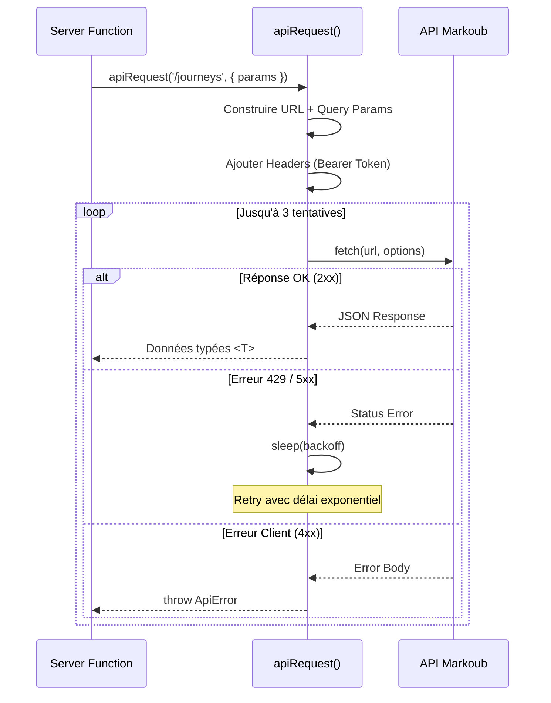

### 5.2 Fichiers API

| Fichier             | Fonctions                       | Endpoint API                   |
| ------------------- | ------------------------------- | ------------------------------ |
| `cities.api.ts`   | `fetchCities(lang)`           | `GET /cities`                |
| `journeys.api.ts` | `fetchJourneys(params)`       | `GET /journeys`              |
| `journeys.api.ts` | `fetchJourneyStops(params)`   | `GET /journeys/stops`        |
| `seat-map.api.ts` | `fetchSeatMap(params)`        | `GET /journeys/seat-map`     |
| `bookings.api.ts` | `createBooking(data)`         | `POST /bookings`             |
| `bookings.api.ts` | `markBookingPaid(code, data)` | `POST /bookings/{code}/paid` |
| `bookings.api.ts` | `fetchBooking(code)`          | `GET /bookings/{code}`       |
| `bookings.api.ts` | `cancelBooking(code)`         | `DELETE /bookings/{code}`    |
| `bookings.api.ts` | `fetchBookingPdf(code)`       | `GET /bookings/{code}/pdf`   |

---

## 6. Couche RPC (Server Functions)

La couche RPC utilise les **Server Functions** de TanStack Start (`createServerFn()`). Ces fonctions s'exécutent côté serveur mais sont appelées depuis le client comme des fonctions normales. Cela garantit que :

- Le **token API** n'est jamais exposé au navigateur
- Les appels réseau vers l'API Markoub sont faits depuis le serveur Node.js
- Le client communique uniquement avec son propre serveur

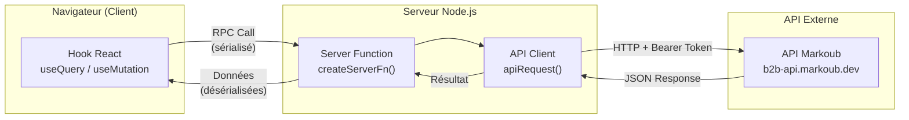

### Liste des Server Functions

| Fichier RPC            | Fonction exportée  | Méthode | Appelle                  |
| ---------------------- | ------------------- | -------- | ------------------------ |
| `cities.ts`          | `getCities`       | GET      | `fetchCities()`        |
| `journeys-search.ts` | `searchJourneys`  | GET      | `fetchJourneys()`      |
| `journeys-stops.ts`  | `getJourneyStops` | GET      | `fetchJourneyStops()`  |
| `seat-map.ts`        | `getSeatMap`      | GET      | `fetchSeatMap()`       |
| `bookings-create.ts` | `createBooking`   | POST     | `apiCreateBooking()`   |
| `bookings-pay.ts`    | `markBookingPaid` | POST     | `apiMarkBookingPaid()` |
| `bookings-get.ts`    | `getBooking`      | GET      | `fetchBooking()`       |
| `bookings-cancel.ts` | `cancelBooking`   | POST     | `apiCancelBooking()`   |

---

## 7. Couche Hooks (État & Données)

Les hooks React encapsulent la logique de fetching avec **TanStack React Query**. Ils fournissent :

- **Caching automatique** avec `staleTime` configuré
- **Refetch conditionnel** via le paramètre `enabled`
- **Mutations** avec gestion d'état (loading, error, success)

### Hooks de Lecture (useQuery)

| Hook                              | Fichier             | Query Key                           | Données retournées    |
| --------------------------------- | ------------------- | ----------------------------------- | ----------------------- |
| `useCities(lang)`               | `use-cities.ts`   | `['cities', lang]`                | `City[]`              |
| `useJourneySearch(params)`      | `use-journeys.ts` | `['journeys', params]`            | `JourneySearchResult` |
| `useJourneyStops(id, searchId)` | `use-journeys.ts` | `['journey-stops', id, searchId]` | `JourneyStop[]`       |
| `useSeatMap(id, searchId)`      | `use-journeys.ts` | `['seat-map', id, searchId]`      | `SeatMapResponse[]`   |
| `useBooking(code)`              | `use-booking.ts`  | `['booking', code]`               | `Booking`             |

### Hooks de Mutation (useMutation)

| Hook                     | Fichier            | Action                               |
| ------------------------ | ------------------ | ------------------------------------ |
| `useCreateBooking()`   | `use-booking.ts` | Crée une nouvelle réservation      |
| `useMarkBookingPaid()` | `use-booking.ts` | Marque une réservation comme payée |
| `useCancelBooking()`   | `use-booking.ts` | Annule une réservation              |

---

## 8. Couche UI (Pages & Composants)

### 8.1 Carte de Navigation (Sitemap)

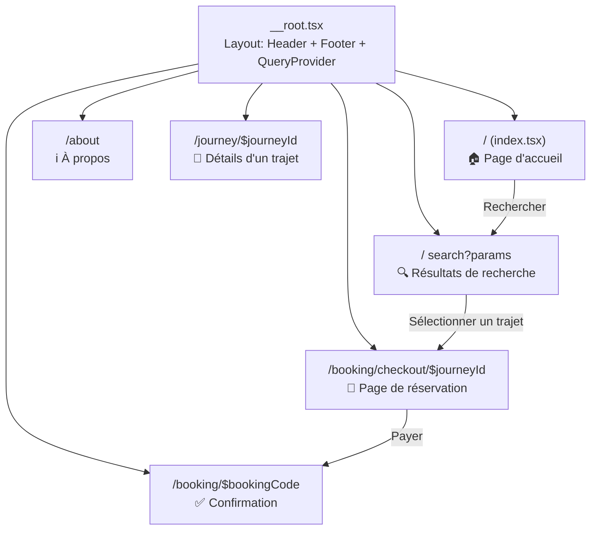

### 8.2 Pages

| Route                                                                  | Fichier                                                  | Description                                                    |
| ---------------------------------------------------------------------- | -------------------------------------------------------- | -------------------------------------------------------------- |
| `/`                                                                  | `index.tsx`                                            | Page d'accueil avec Hero, Stats, Services, Routes populaires   |
| `/search`                                                            | `search.tsx`                                           | Résultats de recherche avec filtres et liste de journey cards |
| `/about`                                                             | `about.tsx`                                            | Page de présentation de l'entreprise                          |
| `/journey/$journeyId` | `journey/$journeyId.tsx`                   | Détails détaillés d'un trajet spécifique             |                                                                |
| `/booking/checkout/$journeyId` | `booking/checkout.$journeyId.tsx` | Page checkout : sièges + formulaire passager + paiement |                                                                |
| `/booking/$bookingCode` | `booking/$bookingCode.tsx`               | Confirmation de réservation avec billet                 |                                                                |

### 8.3 Composants

#### Composants Globaux

- `Header.tsx` — Barre de navigation principale
- `Footer.tsx` — Pied de page avec informations de l'entreprise
- `ThemeToggle.tsx` — Basculement thème clair/sombre

#### Composants Page d'Accueil (`home/`)

- `hero-section.tsx` — Bannière principale avec formulaire de recherche
- `stats-section.tsx` — Statistiques clés (+15K tickets/jour, +80 destinations)
- `services-section.tsx` — Présentation des services (Parc, Réseau, Tourisme, Messagerie)
- `popular-routes.tsx` — Grille des itinéraires populaires

#### Composants Recherche (`search/`)

- `search-form.tsx` — Formulaire complet : ville départ, ville arrivée, date, nombre de passagers

#### Composants Trajet (`journey/`)

- `journey-card.tsx` — Carte de résultat avec prix, horaires et bouton de réservation

#### Composants Réservation (`booking/`)

- `seat-selection-card.tsx` — Carte résumant les sièges sélectionnés
- `seat-map-modal.tsx` — Modal plein écran avec plan interactif du bus
- `passenger-form-section.tsx` — Formulaire des informations passager (nom, email, téléphone)
- `payment-section.tsx` — Sélection du mode de paiement (carte ou espèces)
- `booking-sidebar.tsx` — Résumé du trajet et prix avec bouton "Passer au paiement"

#### Composants UI (`ui/`) — shadcn/ui

- `button.tsx`, `calendar.tsx`, `input.tsx`, `label.tsx`, `skeleton.tsx`

---

## 9. Logique Métier (Business Logic)

### 9.1 Flux de Réservation Complet

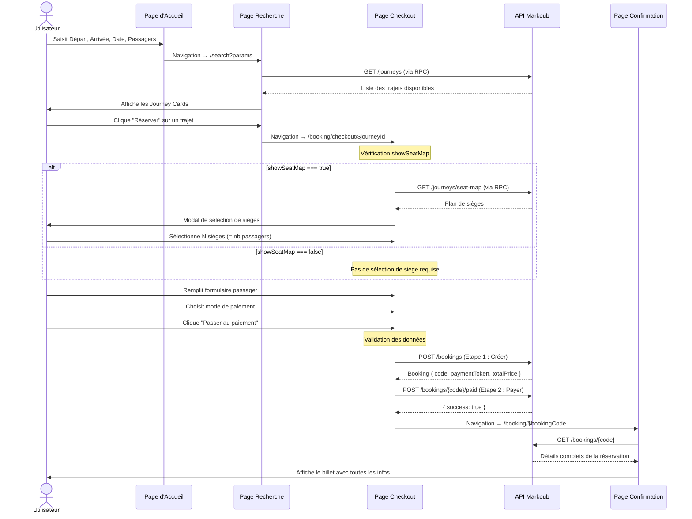

### 9.2 Règles de Validation

#### Validation des Sièges (Conditionnelle)

```
SI journey.showSeatMap === true ALORS
  ├── Le passager DOIT sélectionner des sièges
  ├── Le nombre de sièges sélectionnés DOIT = nbrOfPassengers
  └── Blocage de la réservation si non respecté

SINON (showSeatMap === false / null / undefined)
  ├── Pas de sélection de siège requise
  ├── La section "Sélection de siège" affiche un message informatif
  └── Le processus de paiement est directement accessible
```

#### Validation du Formulaire Passager

```
REQUIS :
  ├── name   → Ne doit pas être vide
  ├── email  → Ne doit pas être vide
  └── phone  → Ne doit pas être vide
```

### 9.3 Processus de Paiement Séquentiel

Le paiement se fait en **2 étapes distinctes** gérées séquentiellement dans `handleProcessBooking()` :

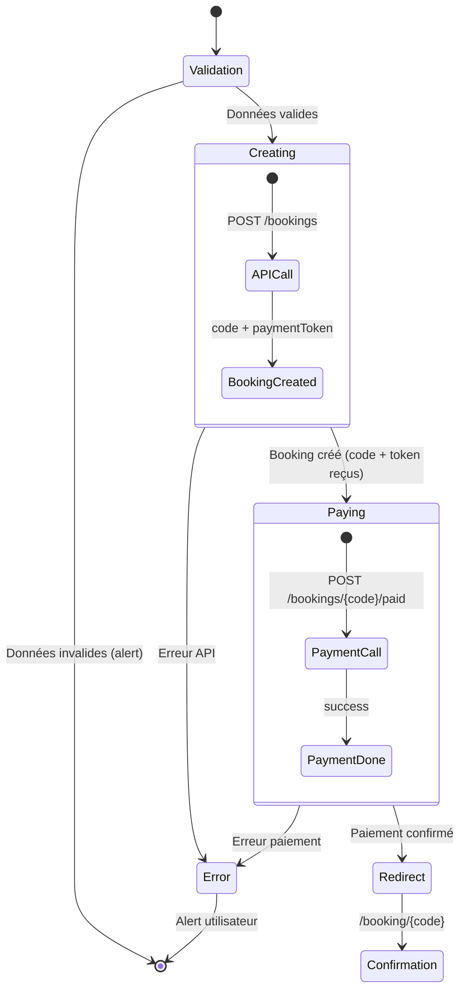

### 9.4 Gestion du Thème (Clair/Sombre)

Le thème est géré via un script d'initialisation injecté dans le `<head>` pour éviter le flash de thème (FOUC). Il prend en charge 3 modes : `light`, `dark`, et `auto` (suit les préférences système).

---

## 10. Documentation API Markoub

### Base URL

```
https://b2b-api.markoub.dev
```

### Authentification

```
Authorization: Bearer {MARKOUB_API_TOKEN}
Content-Type: application/json
```

### Endpoints

#### 🏙️ Villes

| Méthode | Endpoint              | Description                           |
| -------- | --------------------- | ------------------------------------- |
| `GET`  | `/cities?lang={fr}` | Liste de toutes les villes desservies |

**Réponse** : `City[]`

```typescript
{ id: number, name: string, latitude: string, longitude: string }
```

---

#### 🚌 Trajets

| Méthode | Endpoint               | Description                         |
| -------- | ---------------------- | ----------------------------------- |
| `GET`  | `/journeys`          | Rechercher des trajets disponibles  |
| `GET`  | `/journeys/stops`    | Obtenir les arrêts intermédiaires |
| `GET`  | `/journeys/seat-map` | Obtenir le plan de sièges          |

**GET /journeys — Paramètres :**

| Paramètre          | Type   | Requis | Description                         |
| ------------------- | ------ | ------ | ----------------------------------- |
| `departureCityId` | number | ✅     | ID de la ville de départ           |
| `arrivalCityId`   | number | ✅     | ID de la ville d'arrivée           |
| `date`            | string | ✅     | Date au format `YYYY-MM-DD`       |
| `nbrOfPassengers` | number | ✅     | Nombre de passagers                 |
| `searchId`        | string | ❌     | ID de recherche pour réutilisation |

**Réponse** : `JourneySearchResult`

```typescript
{
  searchId: string,          // Identifiant unique de cette session de recherche
  expiresAt: string,         // Date d'expiration de la session
  expiresInMinutes: number,  // Minutes avant expiration
  journeys: Journey[]        // Liste des trajets disponibles
}
```

**GET /journeys/stops — Paramètres :**

| Paramètre    | Type   | Requis |
| ------------- | ------ | ------ |
| `journeyId` | number | ✅     |
| `searchId`  | string | ✅     |

**GET /journeys/seat-map — Paramètres :**

| Paramètre    | Type   | Requis |
| ------------- | ------ | ------ |
| `journeyId` | number | ✅     |
| `searchId`  | string | ✅     |

**Réponse** : `SeatMapResponse[]`

```typescript
{
  selectedSeats: { seatNumber: number, index: string }[],
  seatMap: Seat[][]  // Grille 2D du bus
}
// Chaque Seat :
{ type: 'available' | 'reserved' | 'empty' | 'closed', index: string, seatNumber: number }
```

---

#### 🎫 Réservations

| Méthode   | Endpoint                  | Description                             |
| ---------- | ------------------------- | --------------------------------------- |
| `POST`   | `/bookings`             | Créer une nouvelle réservation        |
| `POST`   | `/bookings/{code}/paid` | Marquer comme payée                    |
| `GET`    | `/bookings/{code}`      | Obtenir les détails d'une réservation |
| `DELETE` | `/bookings/{code}`      | Annuler une réservation                |
| `GET`    | `/bookings/{code}/pdf`  | Télécharger le billet PDF             |

**POST /bookings — Body :**

```typescript
{
  journeyId: string,
  searchId: string,
  name: string,
  phone: string,
  email: string,
  seats: number[]    // [] si showSeatMap est false
}
```

**Réponse** : `Booking`

```typescript
{
  id: number,
  code: string,              // Code unique de réservation
  paymentToken: string,      // Token pour le processus de paiement
  totalPrice: number,
  status: string,            // 'pending' | 'paid' | 'confirmed' | 'cancelled'
  routes: BookingRoute[],
  tickets: Ticket[],
  // ... autres champs
}
```

**POST /bookings/{code}/paid — Body :**

```typescript
{
  paidPrice: string,
  referenceNumber: string,
  additionalInfo?: string
}
```

---

## 11. Flux de Données

### Vue d'ensemble du flux de données dans l'application

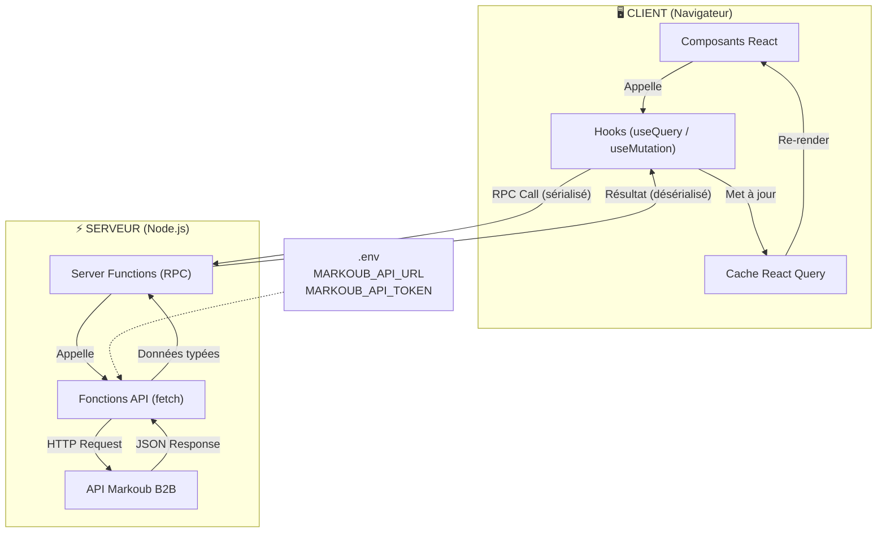

### Cycle de vie d'une requête

1. **Composant** → Le composant React appelle un hook (ex: `useJourneySearch()`)
2. **Hook** → Le hook utilise `useQuery()` avec une `queryFn` qui appelle une Server Function
3. **Server Function** → La server function s'exécute côté serveur, extrait les paramètres, et appelle la fonction API
4. **API Client** → `apiRequest()` construit la requête HTTP avec le token d'authentification
5. **API Externe** → La requête est envoyée à `b2b-api.markoub.dev`
6. **Retour** → La réponse remonte à travers toutes les couches jusqu'au composant
7. **Cache** → React Query met en cache le résultat et gère le rafraîchissement

---

## 12. Modèles de Données (TypeScript)

### Diagramme des Relations entre Types

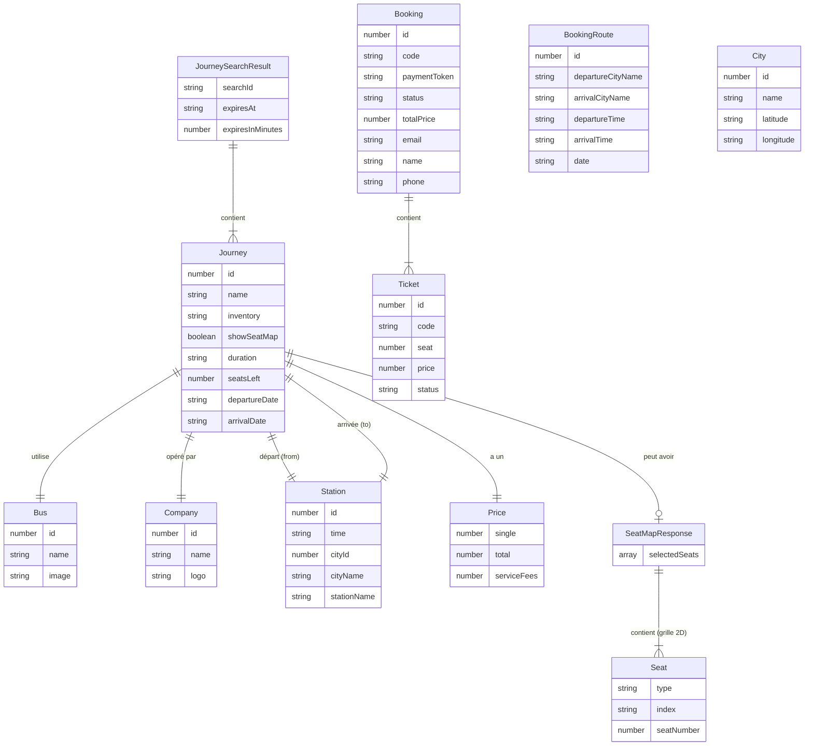

---

## 13. Améliorations et Résilience (Mises à jour récentes)

Afin d'assurer une compatibilité totale avec les variations de l'API Markoub et d'offrir une expérience utilisateur irréprochable, les améliorations suivantes ont été intégrées :

### 13.1 Extraction Robuste du Plan de Sièges (Scanner Récursif)

Les réponses de l'API Markoub pour le `seatMap` peuvent varier selon les trajets (données encapsulées dans `data`, `result`, ou renvoyées directement sous forme de tableau). Pour éviter les erreurs *"Aucun siège disponible"*, une fonction de **recherche récursive** (`findSeatSource`) a été implémentée dans `seat-map-modal.tsx`. Cette fonction parcourt dynamiquement toute la structure JSON renvoyée par le serveur pour débusquer la propriété `seatMap`, garantissant un affichage stable du bus.

### 13.2 Gestion de l'Expiration de Session (`searchId`)

Les sessions de recherche Markoub expirent après un certain délai. Si l'utilisateur reste longtemps sur la page de Checkout, son URL contient un `searchId` obsolète, générant une erreur `500 (Search ID has expired)`.
Pour pallier ce problème :

- La page `checkout.$journeyId.tsx` utilise le hook `useJourneySearch` en arrière-plan pour générer silencieusement une nouvelle session si nécessaire.
- Le code extrait le **nouveau `searchId` frais** (`searchResult?.searchId`) et l'injecte automatiquement dans la requête du plan de siège et dans la requête finale de réservation, évitant ainsi le blocage de l'utilisateur.

### 13.3 Refonte UI Markoub (Thème et Étapes)

L'interface de la page de Checkout a été entièrement alignée sur l'identité visuelle de **Markoub.ma** :

- **Thème** : Utilisation de la couleur orange signature (`#FF6900`) pour les boutons, les états de sélection, et les focus des formulaires.
- **Étapes Numérotées** : Ajout d'indicateurs visuels (1. Passagers, 2. Sièges, 3. Paiement) pour guider l'utilisateur.
- **Modèle de Sièges** : Intégration d'éléments SVG haute fidélité pour le rendu du bus (volant, formes des sièges) reflétant exactement l'interface cible.

---

> **Note** : Ce rapport reflète l'état actuel de l'application. L'architecture est conçue pour être maintenable et extensible, avec une séparation claire entre les couches de présentation, logique métier, et accès aux données.

---

## 14. Conception UML Formelle (Diagramme de Classes)

Suite aux retours de l'encadrement, le diagramme de classes a été simplifié pour privilégier les **associations** standard (plus flexibles pour une architecture API) et corriger les **cardinalités** pour refléter la réalité métier du transport.

### 14.1 Diagramme de Classes Corrigé

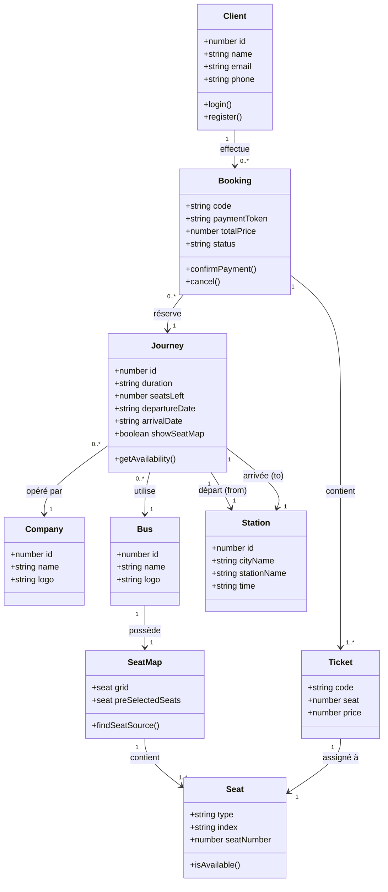

### 14.2 Explication des Cardinalités et Relations

*   **Client → Booking (1 : 0..*)** : Un client (l'entité principale réalisant l'action) peut effectuer aucune ou plusieurs réservations. Une réservation est obligatoirement rattachée à un seul client.
*   **Journey → Company (0..* : 1)** : Une compagnie de transport (ex: Pullman du Sud) peut proposer plusieurs trajets différents, mais un trajet spécifique (une instance de voyage) est opéré par une seule et unique compagnie.
*   **Journey → Station (1 : 1)** : Pour chaque trajet, on définit précisément **une** station de départ et **une** station d'arrivée. C'est une association de direction.
*   **Booking → Journey (* : 1)** : Un trajet de bus peut faire l'objet de plusieurs réservations par différents clients. En revanche, dans notre système, une réservation (`Booking`) est liée à un trajet spécifique (pour l'aller ou le retour).
*   **Booking → Ticket (1 : 1..*)** : Une réservation peut concerner un groupe (plusieurs passagers). Elle contient donc au moins un ticket, ou plusieurs.
*   **Bus → SeatMap (1 : 1)** : Chaque bus possède une configuration de sièges unique définie par un plan (`SeatMap`).

### 14.3 Focus sur l'Objet `Client` (Acteur Principal)

L'objet **`Client`** a été extrait pour devenir la classe principale du diagramme. Il représente l'acteur central du système : l'utilisateur qui effectue les recherches et les réservations. Au lieu de stocker les informations personnelles (nom, email, téléphone) de manière redondante dans chaque `Booking`, ces données sont désormais centralisées dans la classe `Client`. Cela permet d'avoir un historique clair des réservations par utilisateur et pose les bases d'un futur système d'authentification ou de fidélisation (programme voyageur).

### 14.4 Focus sur l'Objet `Journey` (L'Objet Pivot de l'Inventaire)

L'objet **`Journey`** est le cœur (le pivot) de l'inventaire du système d'information. Contrairement à une simple "ligne de bus" (statique), le `Journey` représente une **occurrence réelle** de voyage.

1.  **Intersection Spatio-Temporelle** : Il fait le lien entre un lieu (Stations) et un moment précis (dates de départ/arrivée).
2.  **Gestion de la Capacité** : C'est cet objet qui porte l'attribut `seatsLeft`. Il est mis à jour dynamiquement à chaque réservation.
3.  **Contrôle de Flux** : L'attribut `showSeatMap` détermine si l'application doit déclencher l'interface de sélection interactive ou passer en mode placement automatique.
4.  **Lien Commercial** : Il agrège les informations du transporteur (`Company`) et du véhicule (`Bus`) pour fournir au passager toutes les informations nécessaires à son choix.

En résumé, sans l'objet `Journey`, le système ne peut pas faire le lien entre la recherche de l'utilisateur (Ville A vers Ville B) et l'inventaire réel des places disponibles.

---

## 15. Diagrammes Complémentaires

### 15.1 Diagramme des Cas d'Utilisation (Use Case Diagram)

Ce diagramme illustre les interactions principales entre l'utilisateur (Client) et le système, ainsi que la dépendance envers le système externe (Markoub API).

```mermaid
usecaseDiagram
    actor "Client (Voyageur)" as Client
    actor "Système Externe (Markoub B2B)" as API
  
    rectangle "Plateforme Pullman du Sud" {
        usecase "Rechercher un trajet" as UC1
        usecase "Consulter les trajets disponibles" as UC2
        usecase "Sélectionner des sièges" as UC3
        usecase "Saisir les infos passagers" as UC4
        usecase "Payer la réservation" as UC5
        usecase "Télécharger le billet PDF" as UC6
        usecase "Annuler une réservation" as UC7
    }
  
    Client --> UC1
    Client --> UC2
    Client --> UC3
    Client --> UC4
    Client --> UC5
    Client --> UC6
    Client --> UC7
  
    UC1 ..> UC2 : <<include>>
    UC4 ..> UC3 : <<extend>> (Si le plan est dispo)
    UC5 ..> UC4 : <<include>>
  
    UC2 --> API
    UC3 --> API
    UC5 --> API
    UC6 --> API
    UC7 --> API
```

*(Note : L'affichage natif des `usecaseDiagram` peut varier selon le lecteur Markdown, voici son équivalent en structure fonctionnelle :)*

```mermaid
graph LR
    User([Voyageur])
    API([API Markoub])

    subgraph "Système de Réservation"
        Search(Rechercher un trajet)
        SelectSeat(Sélectionner un siège)
        Book(Réserver un billet)
        Pay(Payer)
        Ticket(Générer Billet PDF)
    end

    User --> Search
    User --> SelectSeat
    User --> Book
    User --> Pay

    Search --> API
    SelectSeat --> API
    Pay --> API
    Ticket --> API

    Book --> SelectSeat : << extends >>
    Pay --> Book : << includes >>
```

### 14.2 Diagramme de Classes (Class Diagram)

Ce diagramme détaille la structure orientée objet des entités manipulées par l'application frontend.

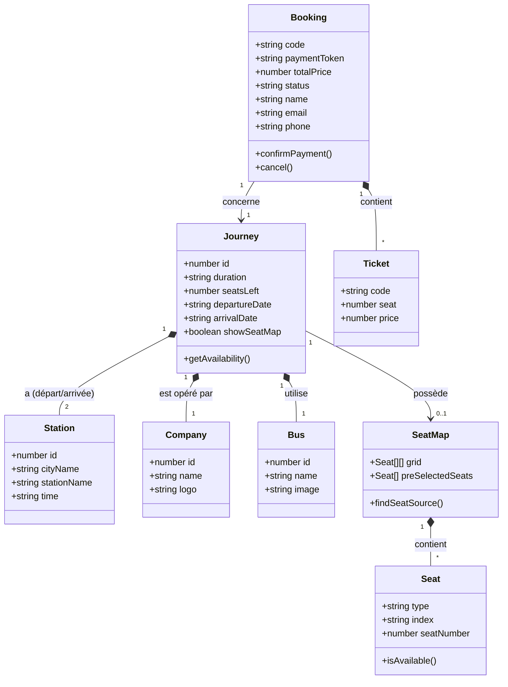

### 14.3 Diagramme de Séquence (Focus : Sélection de Siège & Paiement)

Ce diagramme détaille le flux temporel et les appels asynchrones entre le client, le serveur RPC, et l'API Markoub lors d'un acte d'achat complet.

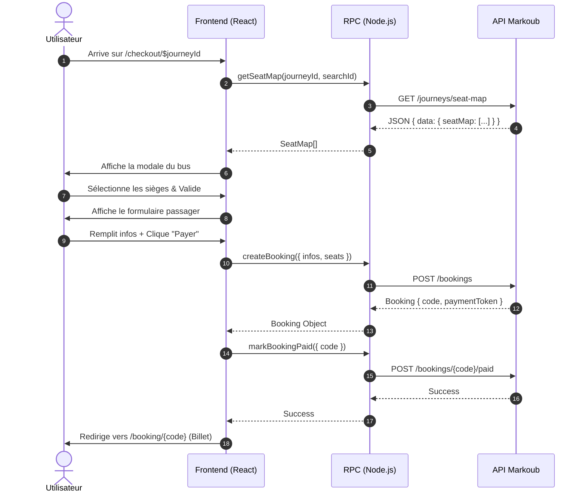

---

## 15. Guide de Préparation à la Soutenance / Réunion

Cette section est conçue pour vous aider à **expliquer et défendre vos choix techniques** de manière simple et claire lors d'une réunion avec votre encadrant.

### Q: Pourquoi avoir structuré le projet en "Couches" (API -> RPC -> Hooks -> UI) ?

**Réponse** : "L'objectif principal est la **séparation des responsabilités (Clean Architecture)**. Si demain l'API Markoub change complètement, je n'ai pas besoin de modifier l'interface utilisateur. Je modifie uniquement la couche `api/`. De plus, cette séparation sécurise l'application : le token d'authentification reste confiné dans le serveur et n'atteint jamais le navigateur de l'utilisateur."

### Q: Qu'est-ce que TanStack Start et pourquoi l'utiliser plutôt qu'un React classique ?

**Réponse** : "TanStack Start est un framework fullstack moderne (comme Next.js). Son atout principal est de me permettre d'écrire des **Server Functions (RPC)**. Cela signifie que je peux créer une fonction TypeScript qui s'exécute côté serveur, mais je peux l'appeler depuis mon composant React client comme si c'était une simple fonction locale. Cela offre une sécurité maximale (pour cacher le token API) tout en gardant un code très simple et entièrement typé."

### Q: Pourquoi avoir choisi TypeScript (Node.js) et non pas Java (JEE / Spring Boot) pour ce projet ?

**Réponse** : "Pour deux raisons principales :

1. **L'Homogénéité (Isomorphisme)** : En utilisant TypeScript, j'utilise le **même langage** côté frontend (React) et côté serveur (Node.js). Cela me permet de partager exactement les mêmes interfaces de données (`src/api/types.ts`) entre le client et le serveur. Si un type change, tout le projet m'alerte, ce qui est impossible si le backend était en Java.
2. **Le rôle du Backend (BFF)** : Notre serveur ne possède pas de base de données complexe, son rôle principal est d'être un "BFF" (*Backend For Frontend*) qui fait office de pont de sécurité vers l'API externe Markoub. Node.js excelle dans la gestion des requêtes réseau asynchrones (I/O). Utiliser un écosystème lourd comme Java Spring Boot juste pour transférer des requêtes HTTP aurait été excessif ('overkill') et aurait ralenti le développement."

### Q: Comment fonctionne le plan de sièges (Seat Map) ?

**Réponse** : "Le plan des sièges est l'un des composants les plus complexes. Lorsque l'utilisateur arrive sur la page de réservation (`checkout`), l'application interroge l'API pour récupérer une 'grille 2D' représentant le bus.
Le composant `SeatMapModal` dessine cette grille. Le défi majeur était que l'API renvoie des formats différents selon le transporteur. J'ai donc implémenté un **'Scanner Récursif'** dans le code frontend : une fonction qui fouille intelligemment la réponse JSON pour y extraire le plan du bus, peu importe comment il est encapsulé. Cela garantit que la fenêtre ne plante jamais."

### Q: Comment avez-vous géré les bugs liés aux sessions expirées ?

**Réponse** : "Pendant mes tests, j'ai remarqué que Markoub invalide les sessions de recherche (`searchId`) après 15 minutes. Si un client met du temps à remplir ses informations, sa réservation échouait avec une erreur 500 au moment de payer.
Pour corriger ça de façon transparente pour l'utilisateur, j'ai configuré la page pour qu'elle utilise un hook `useJourneySearch` en arrière-plan. Si l'URL contient un vieux `searchId`, le système en génère un nouveau en silence et l'utilise pour valider le panier, évitant ainsi un blocage de l'utilisateur."

### Q: Comment se déroule l'orchestration du paiement ?

**Réponse** : "Le paiement nécessite un processus transactionnel strict en 2 étapes obligatoires. J'ai regroupé cette logique dans la fonction `handleProcessBooking` :

1. **Création (POST /bookings)** : On envoie les infos du passager et les sièges. L'API Markoub crée la commande et nous renvoie un code de réservation.
2. **Paiement (POST /bookings/{code}/paid)** : On utilise immédiatement ce code pour valider le paiement (par carte ou espèces).
   Si l'étape 1 réussit mais que l'étape 2 échoue, la réservation reste 'en attente'. Le système est conçu de manière séquentielle (`await`) pour qu'on ne passe à l'étape suivante que si la précédente a été validée par le serveur."

---

## CONCLUSION GÉNÉRALE

*(Bilan global du projet, enseignements tirés, objectifs atteints, et perspectives d'évolution)*

---

## BIBLIOGRAPHIE

1. Exemple Livre : Nom, Prénom. *Titre du livre*. Édition. Lieu : Éditeur, Année.
2. Exemple Article : Nom, Prénom. "Titre de l'article". *Nom de la revue*, volume, numéro, année, pages.

---

## WEBOGRAPHIE

1. Documentation React JS : https://react.dev
2. Documentation TanStack Start & Query : https://tanstack.com
3. Tailwind CSS Framework : https://tailwindcss.com
4. *(Ajoutez les liens vers les autres documentations utilisées)*

---

## ANNEXES

*(Mettez ici d'autres documents complémentaires, captures d'écrans supplémentaires, ou le manuel utilisateur si nécessaire)*
