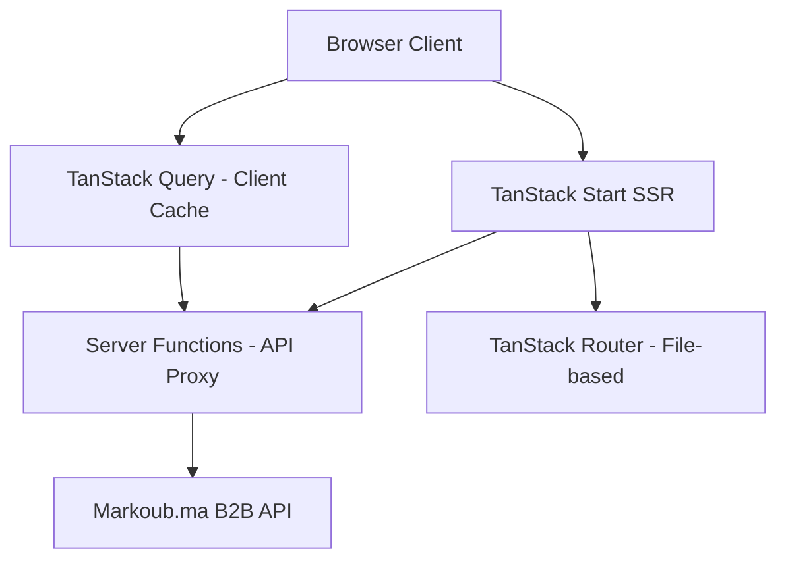

# Bus Ticketing Platform — Implementation Plan

Build a production-ready bus ticketing platform using TanStack Start, React, shadcn/ui, Tailwind CSS, and TypeScript, consuming the Markoub.ma B2B API.

## User Review Required

> [!IMPORTANT]
> **API Token Security**: The provided token `markoub_A7JO72Y7272SPH5VA18IX23H` will be stored in a `.env` file and used **only** on the server side via TanStack Start server functions. It will never be exposed to the client bundle.

> [!WARNING]
> **TanStack Start is relatively new** — it uses Vinxi under the hood and file-based routing via TanStack Router. Some edge-case behaviors may differ from Next.js. We'll use the stable `@tanstack/start` CLI to scaffold the project.

> [!IMPORTANT]
> **Figma designs** cannot be auto-extracted. I'll match the provided screenshots pixel-perfectly:
> - Hero section with canyon image + booking search form
> - Stats bar (+15K, +80, +50K)
> - "Nos Services" cards (Parc, Réseau, Tourisme, Messagerie)
> - "Routes Populaires" grid
> - Footer with company info and links
> - Journey search results page (list of available buses)
> - Seat selection page
> - Booking/passenger info form
> - Booking confirmation page

---

## Architecture Overview



### Key Architectural Decisions
- **Server Functions as API proxy**: All Markoub API calls go through TanStack Start server functions (`createServerFn`). The API token lives server-side only.
- **TanStack Query** for client-side caching, loading states, and retry logic
- **Feature-based folder structure** with clean separation of concerns
- **shadcn/ui + Tailwind CSS** for the design system matching Figma

---

## Proposed Changes

### 1. Project Scaffolding

#### [NEW] Project initialization
```bash
pnpm create @tanstack/start@latest ./ --package-manager pnpm
```

Then install additional dependencies:
```bash
pnpm add @tanstack/react-query lucide-react class-variance-authority clsx tailwind-merge date-fns
pnpm add -D @types/node
```

Initialize shadcn/ui:
```bash
pnpm dlx shadcn@latest init
```

Add shadcn components:
```bash
pnpm dlx shadcn@latest add button input select card dialog popover calendar command separator badge skeleton sheet
```

---

### 2. Environment & Configuration

#### [NEW] `.env`
```
MARKOUB_API_URL=https://b2b-api.markoub.dev
MARKOUB_API_TOKEN=markoub_A7JO72Y7272SPH5VA18IX23H
```

#### [NEW] `.env.example`
```
MARKOUB_API_URL=https://b2b-api.markoub.dev
MARKOUB_API_TOKEN=your_token_here
```

#### [NEW] `.gitignore` (append)
```
.env
.env.local
```

---

### 3. Folder Structure

```
src/
├── api/                          # API service layer
│   ├── client.ts                 # Centralized HTTP client (server-only)
│   ├── types.ts                  # API type definitions
│   ├── cities.api.ts             # Cities endpoints
│   ├── journeys.api.ts           # Journeys endpoints
│   ├── bookings.api.ts           # Bookings endpoints
│   └── seat-map.api.ts           # Seat map endpoints
├── server/                       # Server functions (TanStack Start)
│   ├── cities.server.ts
│   ├── journeys.server.ts
│   ├── bookings.server.ts
│   └── seat-map.server.ts
├── hooks/                        # Custom React hooks
│   ├── use-cities.ts
│   ├── use-journeys.ts
│   ├── use-booking.ts
│   ├── use-seat-map.ts
│   └── use-search-form.ts
├── components/                   # Reusable UI components
│   ├── ui/                       # shadcn/ui primitives
│   ├── layout/
│   │   ├── header.tsx
│   │   ├── footer.tsx
│   │   └── nav-links.tsx
│   ├── search/
│   │   ├── search-form.tsx       # Main booking search form
│   │   ├── city-selector.tsx     # City autocomplete dropdown
│   │   ├── date-picker.tsx       # Date picker
│   │   └── passenger-selector.tsx
│   ├── journey/
│   │   ├── journey-card.tsx      # Single journey result card
│   │   ├── journey-list.tsx      # List of journeys
│   │   ├── journey-filters.tsx   # Filter/sort controls
│   │   └── journey-details.tsx   # Expanded journey info
│   ├── seat-map/
│   │   ├── seat-map.tsx          # Bus seat map layout
│   │   ├── seat.tsx              # Individual seat component
│   │   └── seat-legend.tsx       # Seat type legend
│   ├── booking/
│   │   ├── passenger-form.tsx    # Passenger details form
│   │   ├── booking-summary.tsx   # Booking summary card
│   │   └── booking-confirmation.tsx
│   └── home/
│       ├── hero-section.tsx
│       ├── stats-section.tsx
│       ├── services-section.tsx
│       └── popular-routes.tsx
├── routes/                       # TanStack Router file-based routes
│   ├── __root.tsx                # Root layout
│   ├── index.tsx                 # Home page (/)
│   ├── search.tsx                # Journey search results (/search)
│   ├── journey/
│   │   └── $journeyId.tsx        # Journey details & seat selection
│   ├── booking/
│   │   ├── new.tsx               # Create booking form
│   │   └── $bookingCode.tsx      # Booking confirmation/details
│   └── about.tsx                 # About page
├── lib/
│   ├── utils.ts                  # Utility functions (cn, formatPrice, etc.)
│   ├── constants.ts              # App-wide constants
│   └── validators.ts             # Zod schemas for form validation
└── styles/
    └── globals.css               # Global styles + Tailwind config
```

---

### 4. API Service Layer

#### [NEW] `src/api/client.ts`
Centralized HTTP client that:
- Uses `fetch` with base URL from env
- Attaches `Authorization: Bearer <token>` header
- Handles error responses with typed error objects
- Implements retry logic (exponential backoff for 429/500)
- Only runs on the server

#### [NEW] `src/api/types.ts`
Full TypeScript interfaces for all API responses:

| Type | Fields |
|------|--------|
| `City` | `id`, `name`, `latitude`, `longitude` |
| `Journey` | `id`, `name`, `bus`, `company`, `from`, `to`, `price`, `duration`, `seatsLeft`, `showSeatMap`, `equipments`, `tags`, etc. |
| `JourneySearchResult` | `searchId`, `expiresAt`, `expiresInMinutes`, `journeys[]` |
| `SeatMap` | `selectedSeats[]`, `seatMap[][]` |
| `Seat` | `type` (selected/available/reserved/empty/closed), `index`, `seatNumber` |
| `Booking` | `id`, `code`, `status`, `totalPrice`, `routes[]`, `tickets[]`, etc. |
| `BookingRoute` | departure/arrival details, price, seat info |
| `Ticket` | `id`, `code`, `seat`, `price`, `status` |

---

### 5. Server Functions

Using `createServerFn` from `@tanstack/start`:

#### [NEW] `src/server/cities.server.ts`
- `getCities(lang?: 'fr' | 'ar' | 'en')` — GET `/cities?lang=`

#### [NEW] `src/server/journeys.server.ts`
- `searchJourneys({ departureCityId, arrivalCityId, date, passengers, previousSearchId? })`
- `getJourneyStops({ journeyId, searchId })`

#### [NEW] `src/server/seat-map.server.ts`
- `getJourneySeatMap({ journeyId, searchId })`

#### [NEW] `src/server/bookings.server.ts`
- `createBooking({ journeyId, searchId, name, phone, email, seats })`
- `markBookingPaid({ code, paidPrice, referenceNumber, additionalInfo })`
- `cancelBooking({ code })`
- `getBooking({ code })`

---

### 6. Custom Hooks (TanStack Query)

#### [NEW] `src/hooks/use-cities.ts`
```typescript
export function useCities(lang = 'fr') {
  return useQuery({
    queryKey: ['cities', lang],
    queryFn: () => getCities(lang),
    staleTime: 24 * 60 * 60 * 1000, // Cities rarely change
  })
}
```

#### [NEW] `src/hooks/use-journeys.ts`
```typescript
export function useJourneySearch(params) {
  return useQuery({
    queryKey: ['journeys', params],
    queryFn: () => searchJourneys(params),
    enabled: !!params.departureCityId && !!params.arrivalCityId,
    retry: 2,
  })
}
```

Similar patterns for `use-booking.ts`, `use-seat-map.ts`.

---

### 7. Pages (Routes)

#### [NEW] `src/routes/index.tsx` — Home Page
Sections from Figma:
1. **Header**: Logo "PULLMAN DU SUD" + navigation (Accueil, Voyageurs, Touristique, Messagerie, Qui sommes-nous)
2. **Hero**: Canyon landscape image with overlay text "Book Your Bus Tickets in Minutes" + Search form
3. **Stats**: +15K tickets/day, +80 destinations, +50K satisfied clients
4. **Services**: 4 cards (Parc, Réseau, Tourisme, Messagerie) with icons
5. **Popular Routes**: Grid of route links (Casablanca→Fes, Rabat→Agadir, etc.)
6. **Footer**: Company info, useful links, contact

#### [NEW] `src/routes/search.tsx` — Search Results
- Receives query params: `departureCityId`, `arrivalCityId`, `date`, `passengers`
- Displays filterable/sortable list of journeys
- Each journey card shows: company logo, departure/arrival times, duration, price, seats left
- Click to select → navigate to seat selection or booking

#### [NEW] `src/routes/journey/$journeyId.tsx` — Journey Detail + Seat Selection
- Shows journey details with stops timeline
- If `showSeatMap === true`: renders interactive seat map
- Seat selection with visual feedback (available/selected/reserved states)
- "Continue to booking" button

#### [NEW] `src/routes/booking/new.tsx` — Booking Form
- Passenger info form (name, phone, email)
- Booking summary sidebar
- Form validation with Zod
- Submit → `createBooking` → navigate to confirmation

#### [NEW] `src/routes/booking/$bookingCode.tsx` — Booking Confirmation
- Shows booking details, route info, tickets
- Download PDF option
- Cancel booking option

---

### 8. Design System (Tailwind + shadcn)

#### Color Palette (from Figma screenshots)
```css
--primary: #F97316        /* Orange — main CTA/brand color */
--primary-foreground: #FFFFFF
--background: #FFFFFF
--muted: #F8F9FA          /* Light gray sections */
--card: #FFFFFF
--border: #E5E7EB
--text-primary: #1F2937   /* Dark gray headings */
--text-secondary: #6B7280 /* Medium gray body */
--accent-blue: #3B82F6    /* Info accents */
--accent-green: #10B981   /* Success/available */
--accent-red: #EF4444     /* Error/closed seats */
```

#### Typography
- Font: **Inter** (Google Fonts)
- Headings: Bold, tracked
- Body: Regular weight

---

## Open Questions

> [!IMPORTANT]
> **Language**: The UI in the Figma screenshots is in **French**. Should the app:
> 1. Be French-only (matching the Figma exactly)?
> 2. Support both French and English with i18n?
> 3. Start French-only and add i18n later?

> [!IMPORTANT]
> **Payment integration**: The API has `markBookingPaid` and `markBookingCancelled` endpoints but no actual payment gateway. Should I:
> 1. Simulate payment with a "Mark as Paid" button (for demo/development)?
> 2. Add a placeholder for future payment gateway integration (Stripe, CMI, etc.)?

> [!IMPORTANT]
> **Hero image**: The Figma shows a specific canyon/gorge landscape photo. I'll generate a similar one with the image generation tool. Is that acceptable, or do you have a specific image asset to use?

---

## Verification Plan

### Automated Tests
1. **Build verification**: `pnpm build` must complete without errors
2. **Type checking**: `pnpm typecheck` passes with strict mode
3. **Dev server**: `pnpm dev` starts successfully on localhost:3000
4. **API integration**: Browser test verifying:
   - Cities load in the search dropdowns
   - Journey search returns results
   - Seat map renders correctly
   - Booking flow completes end-to-end

### Manual Verification
- Visual comparison of each page section against Figma screenshots
- Responsive design testing at mobile (375px), tablet (768px), desktop (1440px)
- Error state handling (network errors, empty results)
- Loading state skeleton animations
